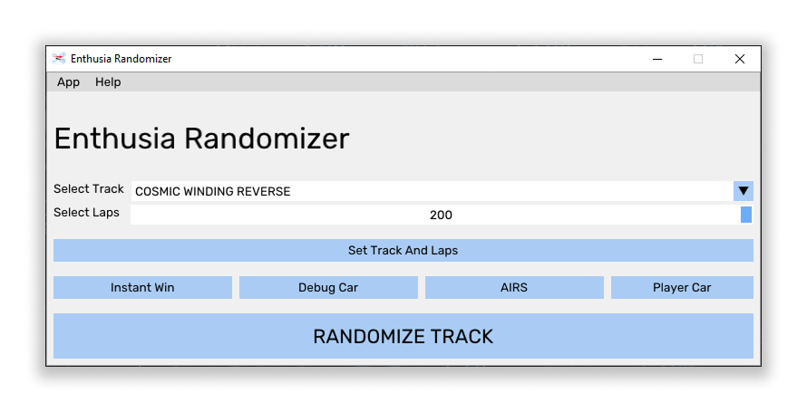
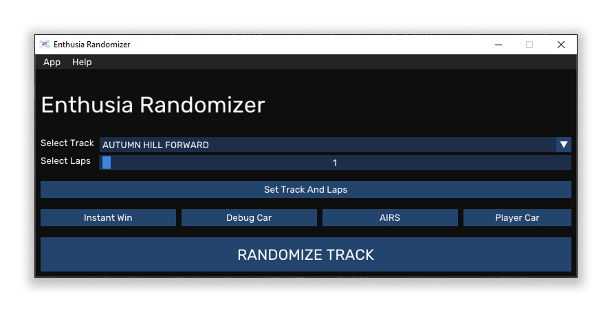
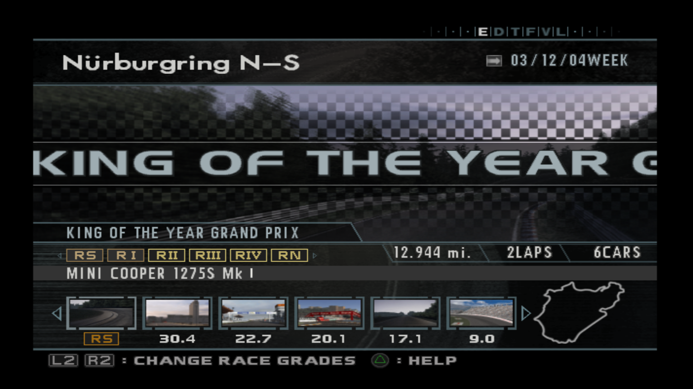

# Enthusia Randomizer
This is a silly little program that allows you to set any track and any amount of laps, or randomize tracks in Enthusia Life mode in Enthusia : Professional Racing, a PS2 Racing game made by Konami.

This was written in C++ using ImGui as the GUI library and windows API.

# Features
- Custom selection of tracks (64 total tracks)
	- Wild West Enduro Reverse does not have lighting or textures
	- Cosmic Winding Reverse is an unused track in the game
	- There are a total of 16 different variations of Mirage Crossing
- Custom amount of laps (upto 200)
	- This can be used to make custom endurance races and even a 24 Hour race
	- Setting to 0 Laps will result in game defaulting to number of laps of that particular event without modification
- Some cheats like
	- Instant Win : You win instantly
	- Debug Car : Useful for free exploration to an extent
	- AIRS : Basically B-Spec for Enthusia, AI drives for you
	- Player Car : Gives back control to player
- Randomize track to any of the 64 tracks
- Help button to bring you to this page
- A theme toggle for the app
- A tooltip toggle for the app

# Requirements
- Windows (currently not supported on Linux or macOS)
- DirectX (Required for GUI)
- PCSX2
- Enthusia Professional Racing (US COPY ONLY)

# Usage
- Download the `.exe` from the `Releases` tab of GitHub
- Open the program
- Open `PCSX2` and run Enthusia in it (US VERSION ONLY)
- When you have chosen what race you want to do and are on this screen below (The screen that shows all events with their odds below them after pressing "Join Race" in garage)
- 
- Go to the program, and choose your parameters
	- You can choose your own Track and Amount of laps and set them by pressing `Set Track And Laps`
		- Choosing 0 Laps chooses the default number of laps from that event from vanila game
	- You can randomize the track by pressing `RANDOMIZE TRACK`
- **VERY IMPORTANT -** As soon as you click one of the two buttons, you have a 30 second window to join the event
	- Join the event in that 30 second window
	- You may encounter some issues listed in [[#Issues]] below. Best way is just to retry.
	- **IMPORTANT NOTE -** DO NOT CLOSE PCSX2 OR THE PROGRAM WHILE THIS 30 SECOND PROCESS IS RUNNING
- If everything goes well, the game should load the track and you should be ready to go
- Do note that this is NOT a whole game setter, this only sets for the current session, and you have to reroll everytime
	- So if you want the next race randomized or custom, you can follow the steps again

# Issues
There are some known issues that may occur while using this program. Some of them are
- When loading into track, sometimes the track might not load, only the minimap may be changed
- Only Laps are affected when setting custom parameters
- Game may infinitely load (get stuck in a load loop)
- PCSX2 may crash

It is recommended you save state **BEFORE** setting the custom parameters or using randomization.

It is also recommended to **NOT** use fast forward when the 30 second window is open for loading into maps. This might lead to issues.

# Method Of Working
The program uses WinAPI to edit memory value of the track ID and number of laps externally. This requires the program to hook to your PCSX2 instance.

Because of these two reasons, this is only supported on Windows as of current.

# Build
As this is a `Visual Studio 2026` project, you need that and atleast `MSVC + tools` and `Windows SDK`.

Open the `.slnx` solution file, and build the program.

As I am not well versed with `CMake` or other building tools, I do not know how well it will work using other systems.

# About
This was made by me with a lot of head banging on the wall to get anything to work properly. As this is my first project worth publishing made in C++, if there are any issues, please inform me in `Issues` tab of GitHub.
